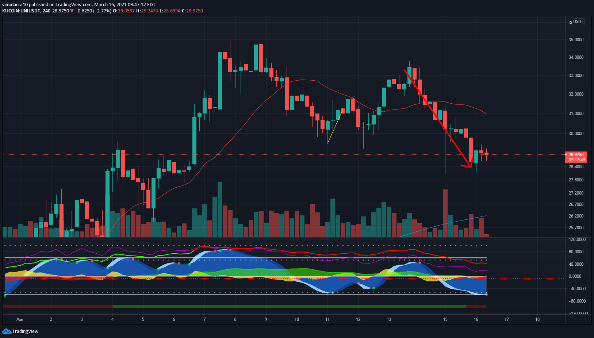
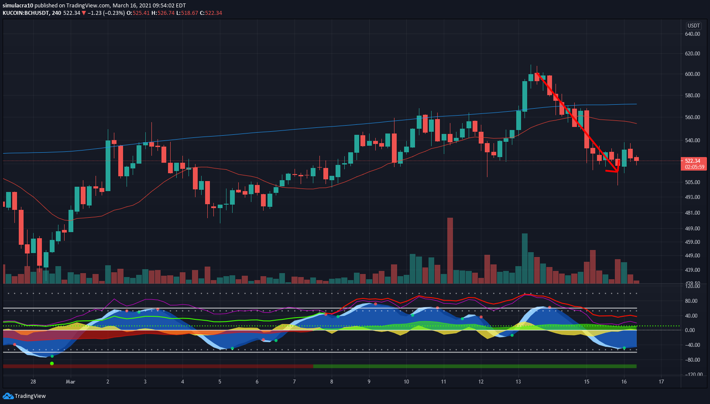

I have decided to start posting the trades I think are interesting to my site. This is not investment advice, so do with it as you wish and take it what it is for. 

Today I have my eye on a two cryptos. 

UNIUSDT

 

UNI has tumbled 14.5% since the 13th on the 4h time frame. MarketCipher B shows a green dot, and while not a glowing green dot, on this time frame it should not be ignored. I am opening a small position in UNI today. 

BCHUSDT

BCH

BitcoinCash is another that had fallen. 15% to be exact. MarketCipher B showed a green dot yesterday on it and since then it has not moved much. I opened a small position on that one last night. 

Both of these I see coming back to their previous highs in a few days time. I'll post an update when I exit the trade and see how I did. 